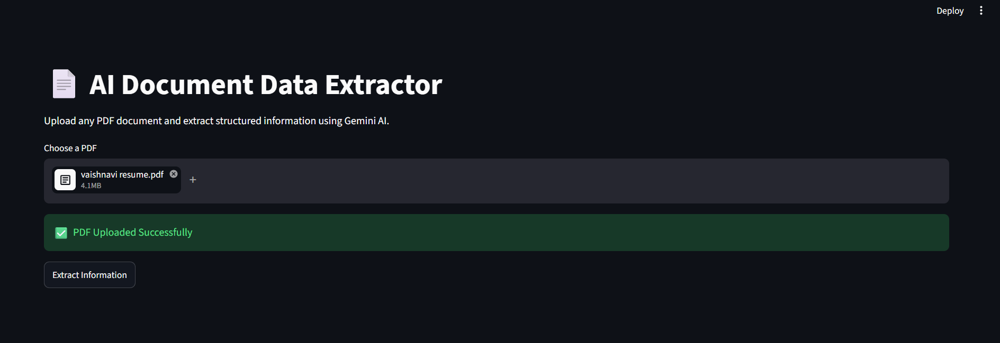
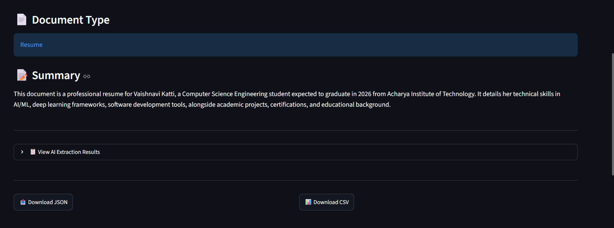
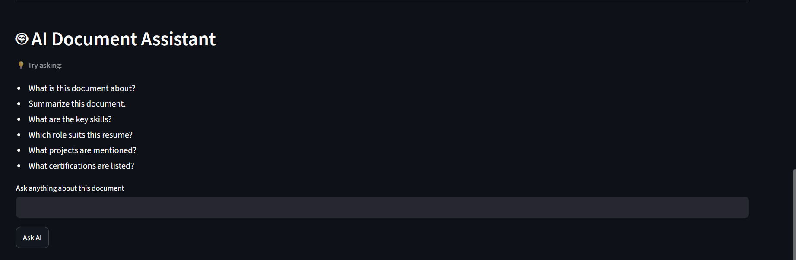
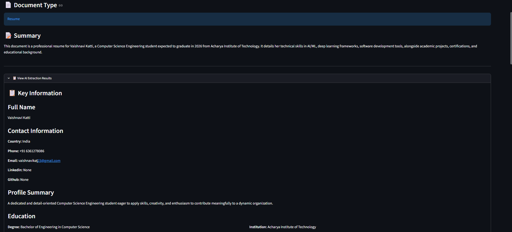
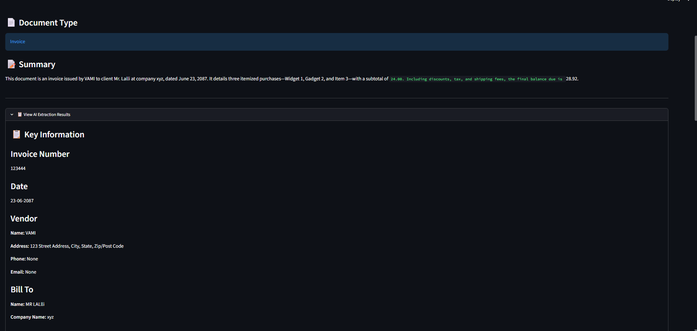
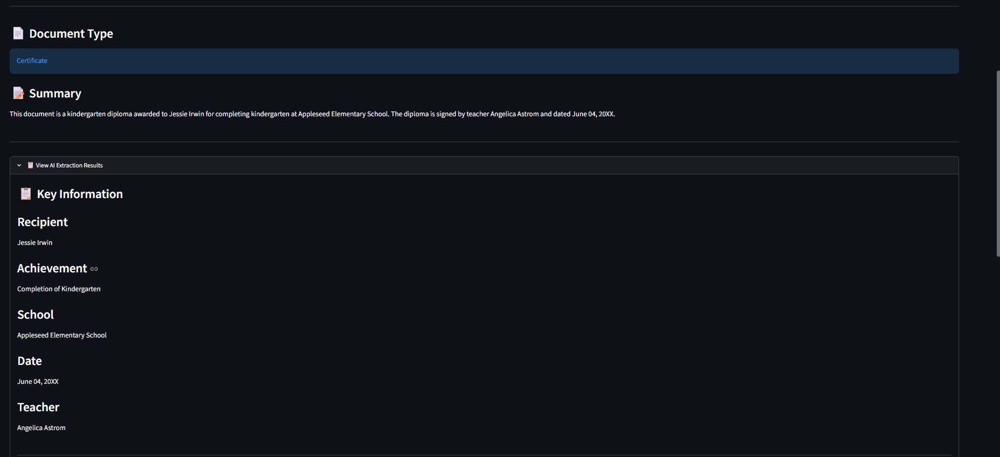

# 📄 AI Document Data Extraction Agent

An AI-powered document analysis application built using **Python**, **Streamlit**, and **Google Gemini AI**. The application automatically extracts structured information from PDF documents, identifies the document type, generates summaries, and allows users to ask questions about the uploaded document using natural language.

---

## 🚀 Features

- 📄 Upload PDF documents
- 🤖 Automatic document type detection
- 📝 AI-generated document summary
- 📋 Structured information extraction
- 📥 Download extracted data as JSON
- 📊 Export extracted data as CSV
- 💬 AI-powered document assistant (Ask Questions)
- 🧠 AI reasoning and inference based on document content
- 📑 Supports multiple document types

---
## 🎥 Demo

### Step 1: Upload a document



### Step 2: Extract information



### Step 3: Ask questions



## 📑 Supported Documents

The application supports extracting information from:

- Resume
- Invoice
- Certificate
- Receipt
- Research Paper
- Notes
- Medical Report
- Letters
- General Text-based PDF Documents

---

## 🛠️ Tech Stack

- Python
- Streamlit
- Google Gemini API (google-genai)
- PyMuPDF (fitz)
- Pandas
- python-dotenv

---

# 📂 Project Structure

```
AI-Document-Data-Extractor/
│
├── app.py
├── extractor.py
├── parser.py
├── qa.py
├── prompts.py
├── requirements.txt
├── README.md
├── .env.example
├── .gitignore
└── screenshots/
```

---

# ⚙️ Installation

### 1. Clone the repository

```bash
git clone https://github.com/poulami128/AI-Document-Data-Extractor.git
```

### 2. Navigate to the project folder

```bash
cd AI-Document-Data-Extractor
```

### 3. Create a virtual environment

```bash
python -m venv .venv
```

### 4. Activate the virtual environment

#### Windows

```bash
.venv\Scripts\activate
```

#### Linux / macOS

```bash
source .venv/bin/activate
```

### 5. Install dependencies

```bash
pip install -r requirements.txt
```

### 6. Configure Gemini API

Create a `.env` file in the project directory.

```
GEMINI_API_KEY=YOUR_GEMINI_API_KEY
```

### 7. Run the application

```bash
streamlit run app.py
```

The application will open automatically in your browser.

Default URL:

```
http://localhost:8501
```

---

# 📂 Test Files

The repository includes sample PDF files that can be used to test the application.

These files are located in the **sample_documents** folder.

Available test files:

- certification.pdf
- GATE_CN_Formula_Sheet (9).pdf
- invoice.pdf
- resumedataset.pdf

These sample files allow reviewers to upload different document types and verify the document extraction, summarization, structured JSON generation, and AI-powered question answering features of the application.

## 🧪 Test Cases

Test cases and expected outputs are provided in the `tests` folder.

They include:

- Resume
- Invoice
- Certificate
- Notes

Reviewers can reproduce the results by uploading the provided sample documents.

# 💬 Example Questions

Users can ask questions such as:

- Who is the candidate?
- Summarize this document.
- What are the key skills?
- Which role suits this resume?
- What projects are mentioned?
- What certifications are listed?
- What is this document about?
- List all important dates.
- Who issued this certificate?
- What is the invoice amount?

---

# 📸 Screenshots

### Home Page


### Resume Analysis


### Resume Extraction



### Invoice Analysis



### Certificate Analysis



### AI Document Assistant


---

# ✅ Validation Logic

The application performs basic validation before displaying extracted information.

- Gemini is instructed to return only valid JSON.
- JSON responses are parsed before displaying.
- Invalid JSON responses are handled gracefully.
- Missing fields are returned as `null` whenever possible.
- Document type is identified before structured extraction.

---

# ⚖️ Trade-offs

### Design Choices

- Google Gemini was selected because of its strong document understanding and reasoning capabilities.
- Streamlit was used to build a lightweight and interactive user interface.
- PyMuPDF was used for efficient PDF text extraction.
- JSON and CSV export options were included for easy reuse of extracted data.
- The AI assistant supports both factual question answering and reasoning-based responses.

### Known Limitations

- Image-only or scanned PDFs may require OCR for accurate extraction.
- Complex tables and highly formatted layouts may not always be extracted perfectly.
- Extraction quality depends on the quality of the uploaded document.

---

# 🔮 Future Improvements

- OCR support for scanned PDFs
- Support for image documents
- Multi-document comparison
- Chat history
- Highlight extracted information directly inside the PDF
- Support for DOCX and image uploads
- Advanced document analytics

---

# 👩‍💻 Author

**Poulami Desai**

Computer Science Engineering

Python | Artificial Intelligence | Machine Learning

---

# 📜 License

This project was developed as part of the **ROOMAN AI 24-Hour Agent Challenge** for educational and evaluation purposes.
